# UML diagrams for chapter 2

This document contains the required figures for chapter 2 of the diploma.
Most diagrams are written in Mermaid so they can be rendered directly from Markdown.
Figures marked as screenshots define the exact screen that should be captured from the running platform.

## Рисунок 2.1. Компонентная диаграмма агентской подсистемы сбора данных

Insert in section 2.2.

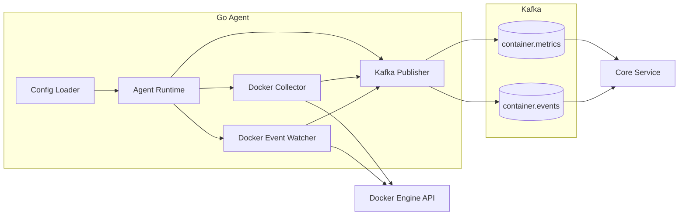

## Рисунок 2.2. UML диаграмма пакетов агентской подсистемы

Insert in section 2.2.1.

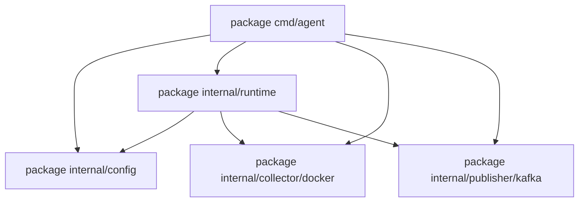

## Рисунок 2.3. Алгоритм периодического сбора метрик контейнеров

Insert in section 2.2.2.

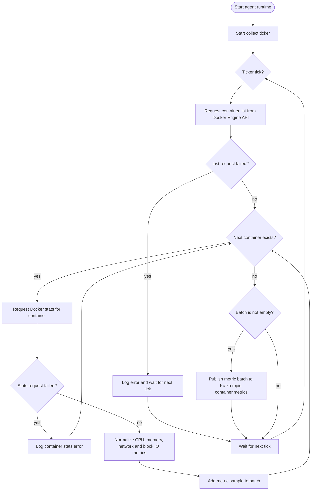

## Рисунок 2.4. Последовательность обработки события жизненного цикла контейнера

Insert in section 2.2.3.

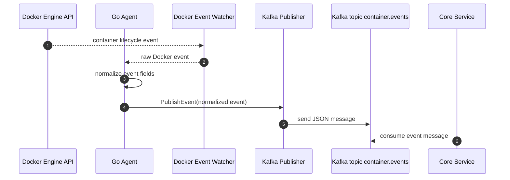

## Рисунок 2.5. Потоки передачи телеметрии от агента к Kafka

Insert in section 2.2.4.

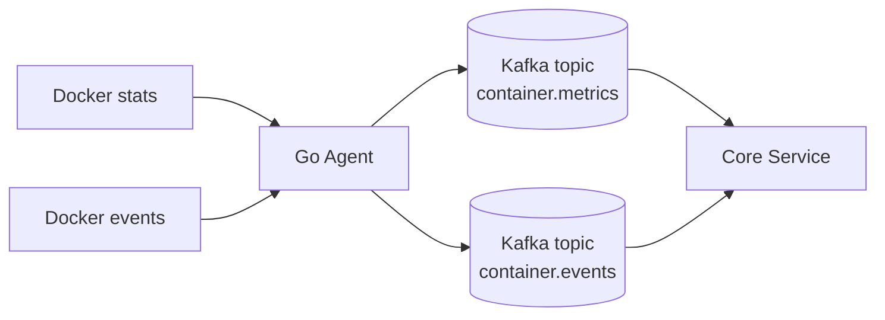

## Рисунок 2.6. Жизненный цикл Go Agent

Insert in section 2.2.5.

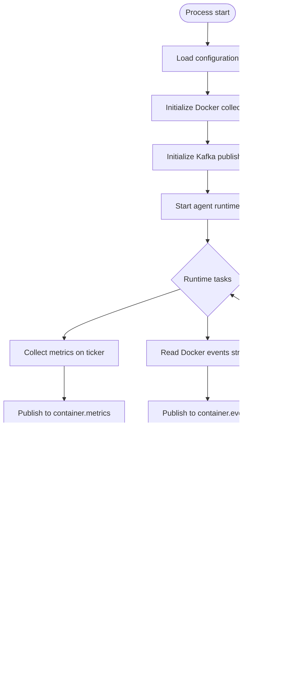

## Рисунок 2.7. Компонентная диаграмма центрального сервиса обработки данных

Insert in section 2.3.

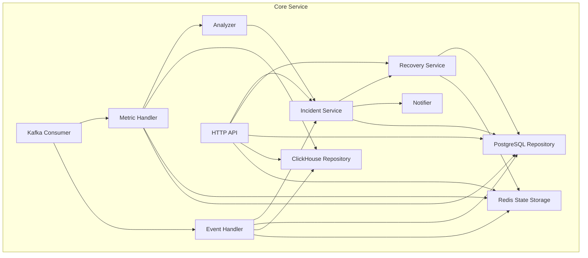

## Рисунок 2.8. UML диаграмма пакетов центрального сервиса

Insert in section 2.3.1.

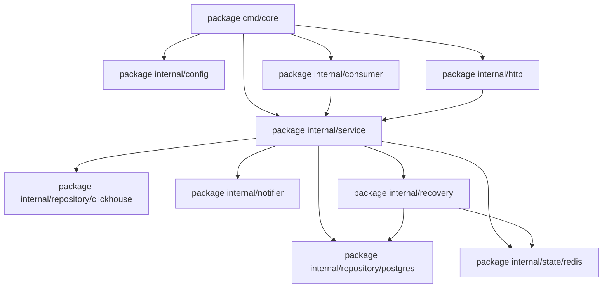

## Рисунок 2.9. Последовательность обработки сообщения телеметрии в Core Service

Insert in section 2.3.2.

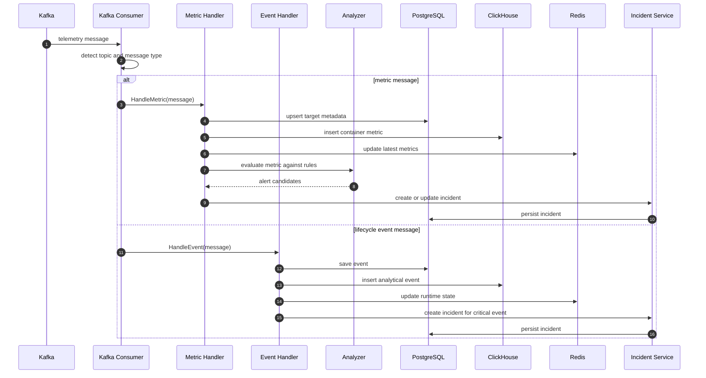

## Рисунок 2.10. ER диаграмма конфигурационных и эксплуатационных сущностей платформы

Insert in section 2.3.3.

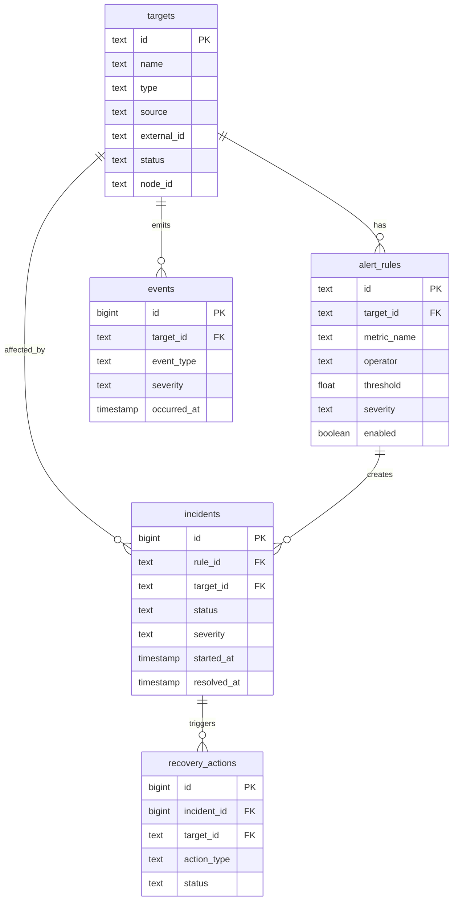

## Рисунок 2.11. Распределение данных между хранилищами платформы

Insert in section 2.3.3.

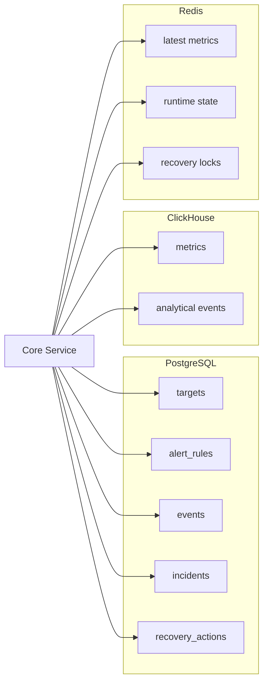

## Рисунок 2.12. Алгоритм применения правила алертинга

Insert in section 2.3.4.

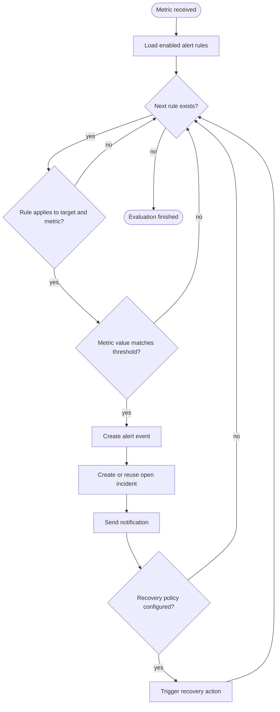

## Рисунок 2.13. Диаграмма состояний инцидента

Insert in section 2.3.4.

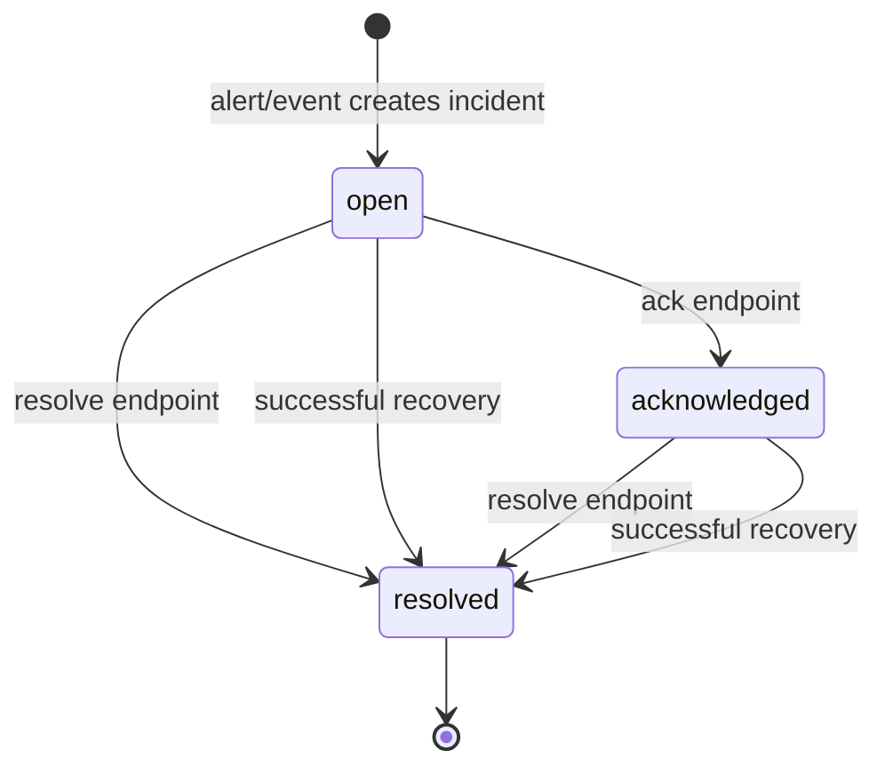

## Рисунок 2.14. Последовательность выполнения восстановительного действия

Insert in section 2.3.5.

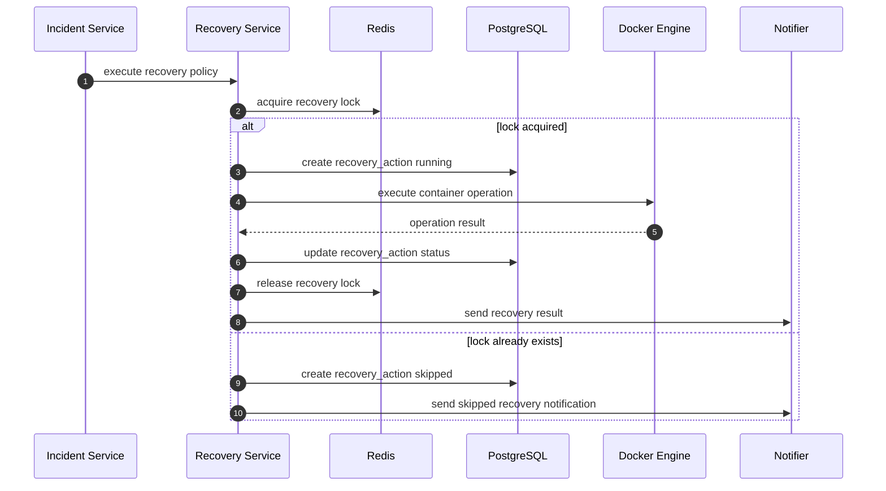

## Рисунок 2.15. Схема отправки уведомления о возникновении инцидента

Insert in section 2.3.6.

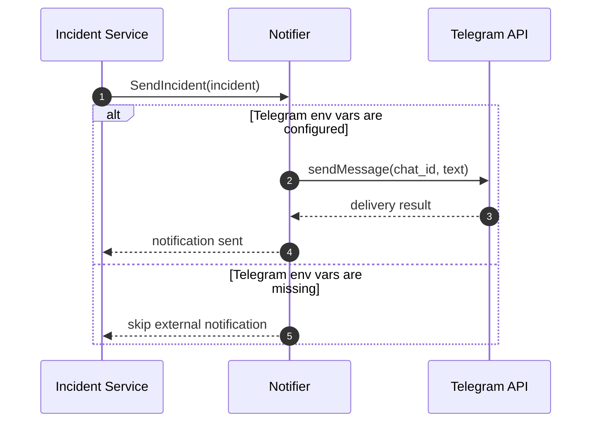

## Рисунок 2.16. Схема пользовательского доступа к платформе мониторинга

Insert in section 2.4.

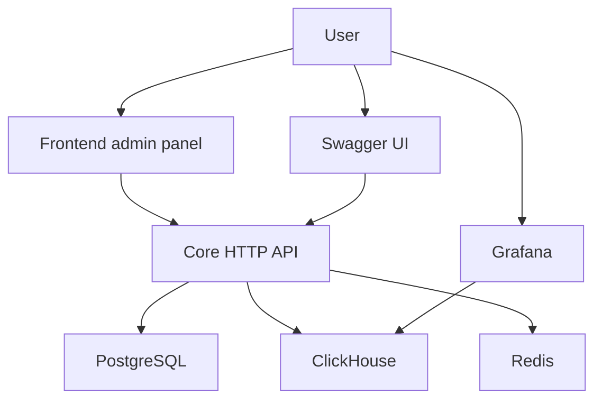

## Рисунок 2.17. Последовательность обработки HTTP запроса в Core Service

Insert in section 2.4.1.

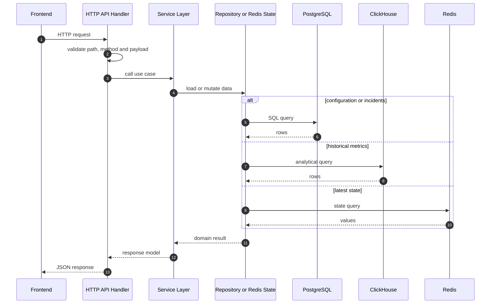

## Рисунок 2.18. Интерфейс Swagger UI с описанием HTTP API платформы

Insert in section 2.4.2.

Screenshot requirements:

- Open Swagger UI for Core Service.
- Capture endpoint groups: health, targets, metrics, events, alert-rules, incidents, recovery-actions.
- Use this Markdown image placeholder after the screenshot is created:

```markdown

```

## Рисунок 2.19. Последовательность подтверждения инцидента через frontend панель

Insert in section 2.4.3.

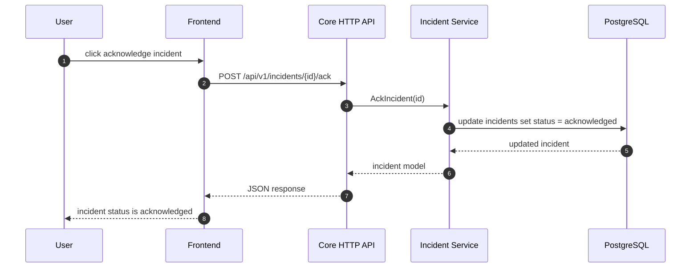

## Рисунок 2.20. Административная панель платформы мониторинга

Insert in section 2.4.3.

Screenshot requirements:

- Open the frontend administration panel.
- Capture one representative section: Incidents, Recovery actions, Latest metrics, or Targets.
- Use this Markdown image placeholder after the screenshot is created:

```markdown

```

## Рисунок 2.21. Интеграция Grafana с аналитическим хранилищем ClickHouse

Insert in section 2.4.4.

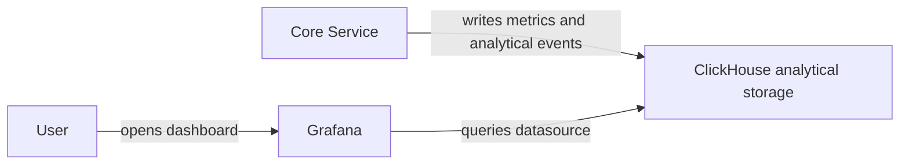

## Рисунок 2.22. Дашборд Container Monitoring MVP в Grafana

Insert in section 2.4.4.

Screenshot requirements:

- Open Grafana dashboard "Container Monitoring MVP".
- Capture panels: CPU usage, Memory usage, Container events over time, Critical event count, Latest container events table.
- Use this Markdown image placeholder after the screenshot is created:

```markdown

```

## Рисунок 2.23. Структура репозитория платформы мониторинга

Insert in section 2.5.1.

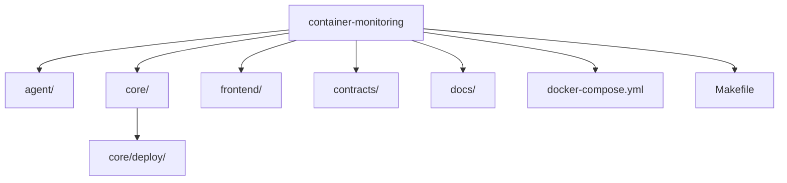

## Рисунок 2.24. Схема локального Docker Compose окружения платформы

Insert in section 2.5.2.

```mermaid
flowchart TB
    subgraph Compose["Local Docker Compose environment"]
        Agent["agent"]
        Core["core"]
        Kafka["kafka"]
        Postgres["postgres"]
        ClickHouse["clickhouse"]
        Redis["redis"]
        Grafana["grafana"]
        Frontend["frontend"]
        TargetNginx["target-nginx"]
    end

    User["User browser"]
    Docker["Docker Engine API"]

    Agent --> Docker
    Core --> Docker
    TargetNginx --> Docker
    Agent --> Kafka
    Core --> Kafka
    Core --> Postgres
    Core --> ClickHouse
    Core --> Redis
    Grafana --> ClickHouse
    Frontend --> Core
    User --> Frontend
    User --> Grafana
    User --> Core
```

## Рисунок 2.25. ER диаграмма основных сущностей PostgreSQL

Insert in section 2.5.3.

```mermaid
erDiagram
    targets ||--o{ alert_rules : configured_for
    targets ||--o{ events : emits
    targets ||--o{ incidents : affected_by
    alert_rules ||--o{ incidents : opens
    incidents ||--o{ recovery_actions : has

    targets {
        text id PK
        text name
        text type
        text source
        text external_id
        text status
        text node_id
        jsonb labels
        timestamptz last_seen_at
        timestamptz created_at
        timestamptz updated_at
    }

    alert_rules {
        text id PK
        text target_id FK
        text metric_name
        text operator
        float threshold
        interval duration
        text severity
        text recovery_policy
        boolean enabled
        timestamptz created_at
        timestamptz updated_at
    }

    events {
        bigserial id PK
        text node_id
        text target_id FK
        text container_name
        text event_type
        text severity
        text message
        jsonb payload
        timestamptz occurred_at
    }

    incidents {
        bigserial id PK
        text rule_id FK
        text target_id FK
        text node_id
        text status
        text severity
        text description
        float value
        timestamptz started_at
        timestamptz acknowledged_at
        timestamptz resolved_at
    }

    recovery_actions {
        bigserial id PK
        bigint incident_id FK
        text target_id FK
        text action_type
        text status
        timestamptz started_at
        timestamptz finished_at
        text result_message
    }
```

## Рисунок 2.26. Логическая схема хранения метрик и событий в ClickHouse

Insert in section 2.5.3.

```mermaid
classDiagram
    class container_metrics {
        +DateTime64 timestamp
        +String node_id
        +String target_id
        +String container_name
        +Float64 cpu_percent
        +UInt64 memory_usage_bytes
        +UInt64 memory_limit_bytes
        +UInt64 network_rx_bytes
        +UInt64 network_tx_bytes
        +UInt64 block_read_bytes
        +UInt64 block_write_bytes
    }

    class container_events {
        +DateTime64 timestamp
        +String node_id
        +String target_id
        +String container_name
        +String event_type
        +String severity
        +String message
        +String payload_json
    }

    container_metrics ..> container_events : correlated by timestamp, node_id and target_id
```

## Рисунок 2.27. Итоговая схема сборки и запуска платформы мониторинга

Insert in section 2.5.5.

```mermaid
flowchart LR
    Source["Source code"]
    Dockerfile["Dockerfile"]
    Compose["docker-compose.yml"]
    Migrations["Database migrations"]
    Infra["Start infrastructure\nKafka, PostgreSQL, ClickHouse, Redis"]
    Services["Start agent and core"]
    UI["Start frontend and Grafana"]
    Ready["Container Monitoring platform is ready"]

    Source --> Dockerfile
    Dockerfile --> Compose
    Source --> Migrations
    Compose --> Infra
    Migrations --> Infra
    Infra --> Services
    Services --> UI
    UI --> Ready
```
