# UML diagrams for the diploma

This document contains Mermaid diagrams for the `container-monitoring` project.
The diagrams are written as ready-to-copy Markdown blocks.

## 1. System context diagram

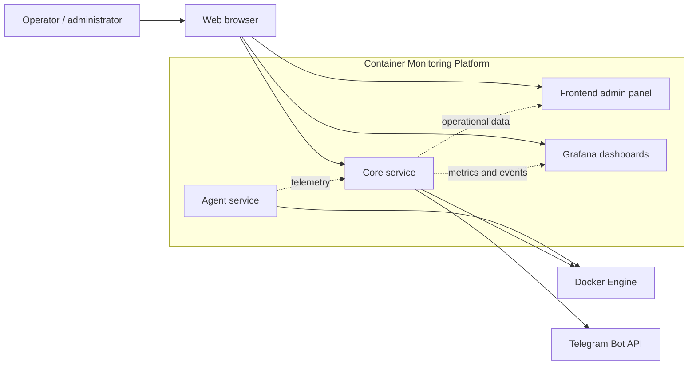

## 2. Container-level component diagram

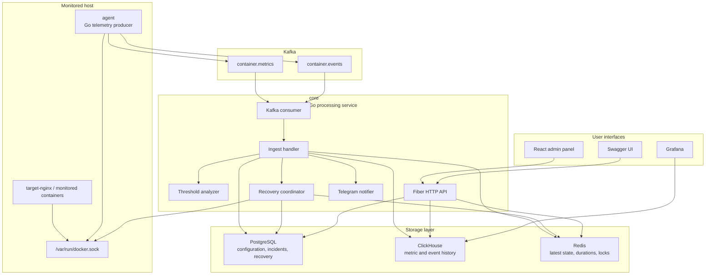

## 3. Deployment diagram

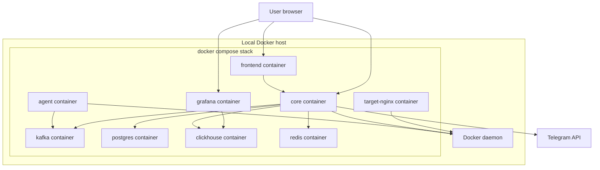

## 4. Agent internal structure

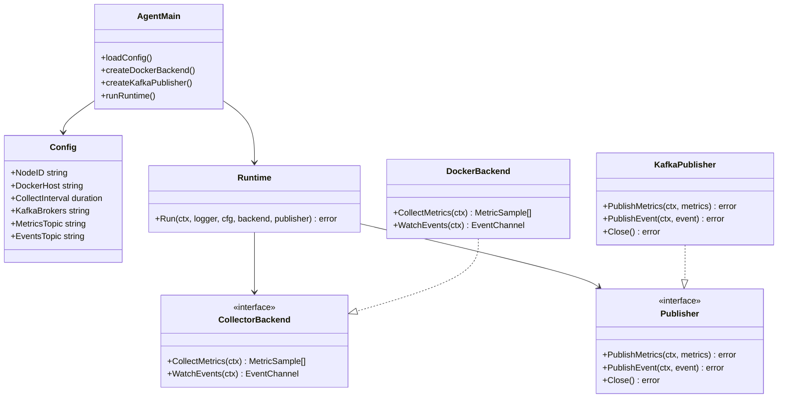

## 5. Core internal structure

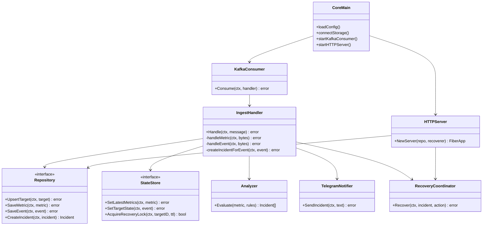

## 6. Domain model class diagram

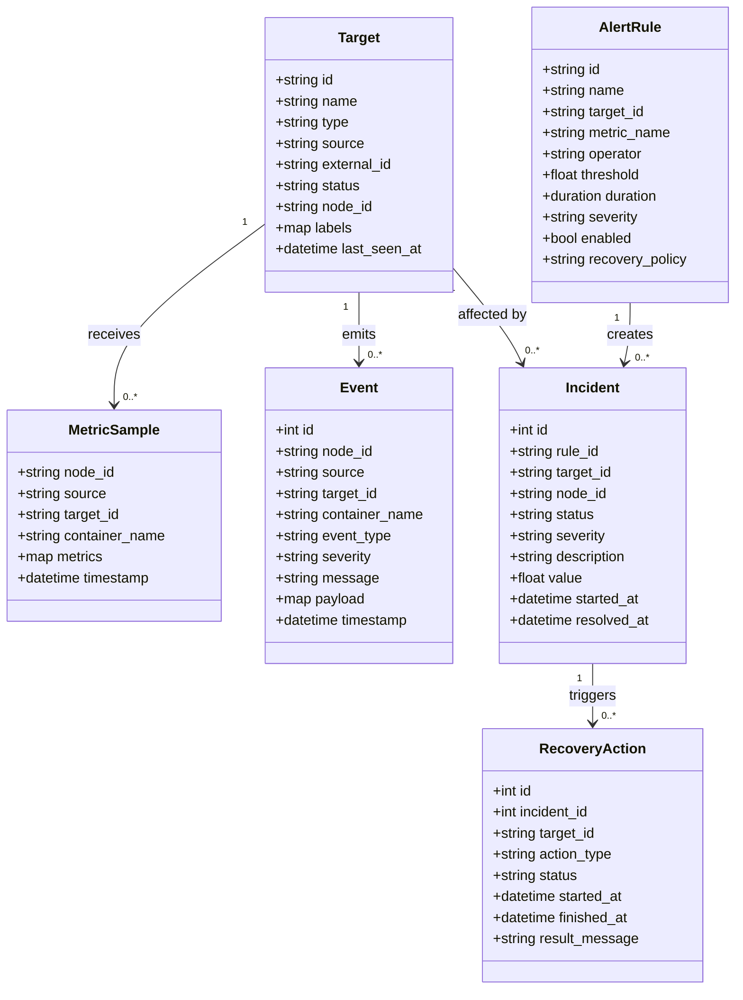

## 7. Storage model diagram

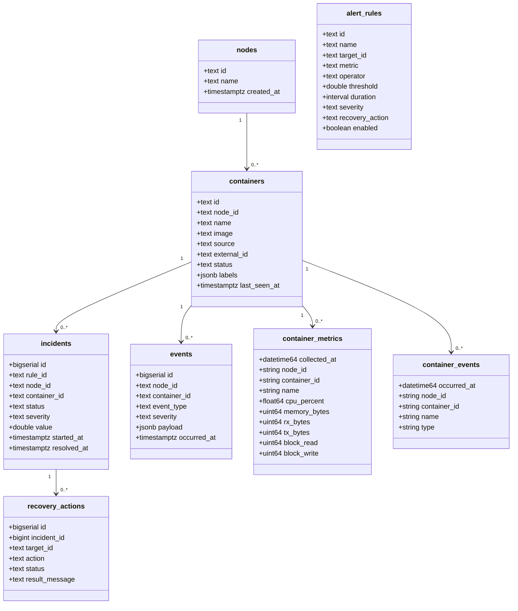

## 8. Metric collection sequence

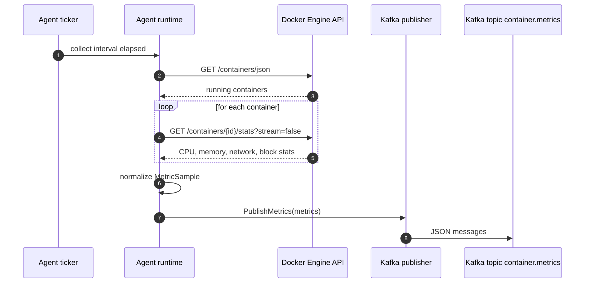

## 9. Metric ingest and threshold alert sequence

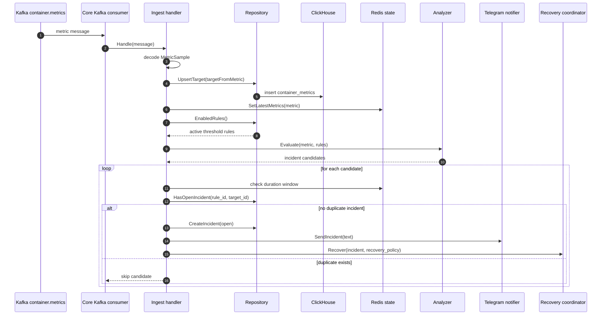

## 10. Docker event and self-healing sequence

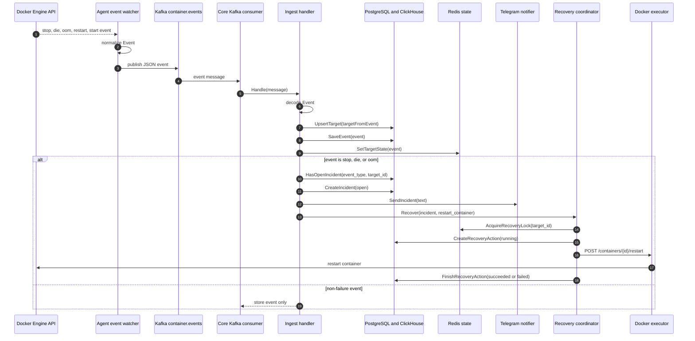

## 11. Frontend API interaction sequence

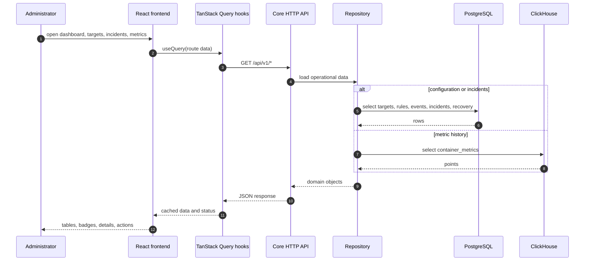

## 12. Alert rule management sequence

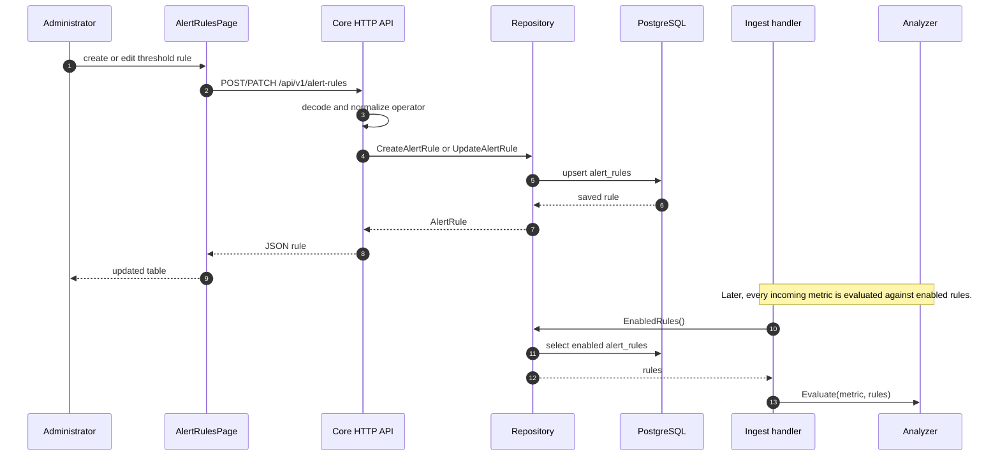

## 13. Target status state diagram

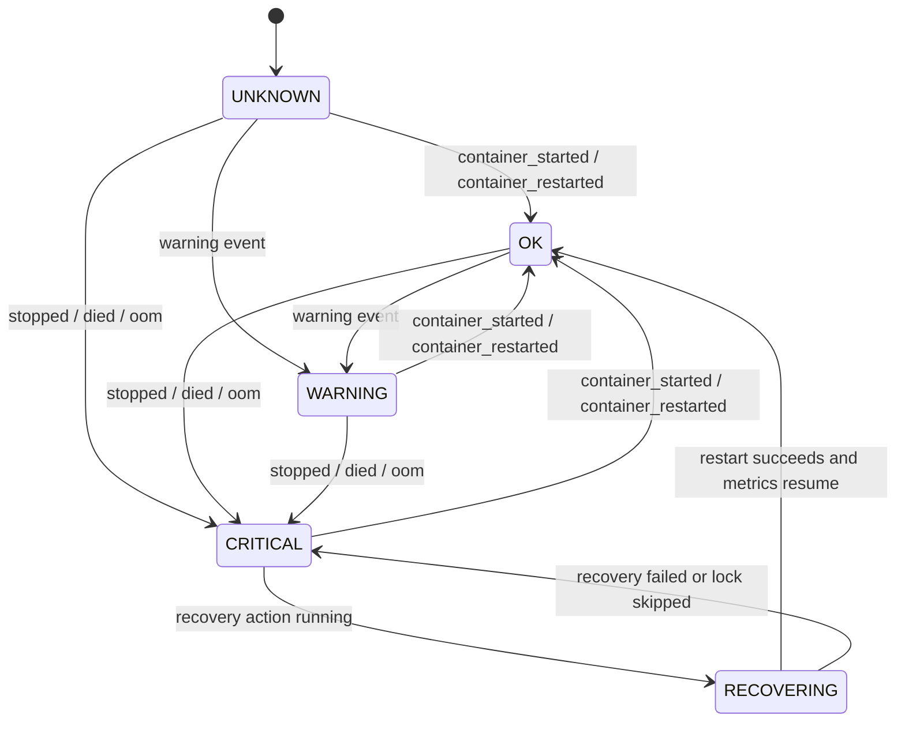

## 14. Incident lifecycle state diagram

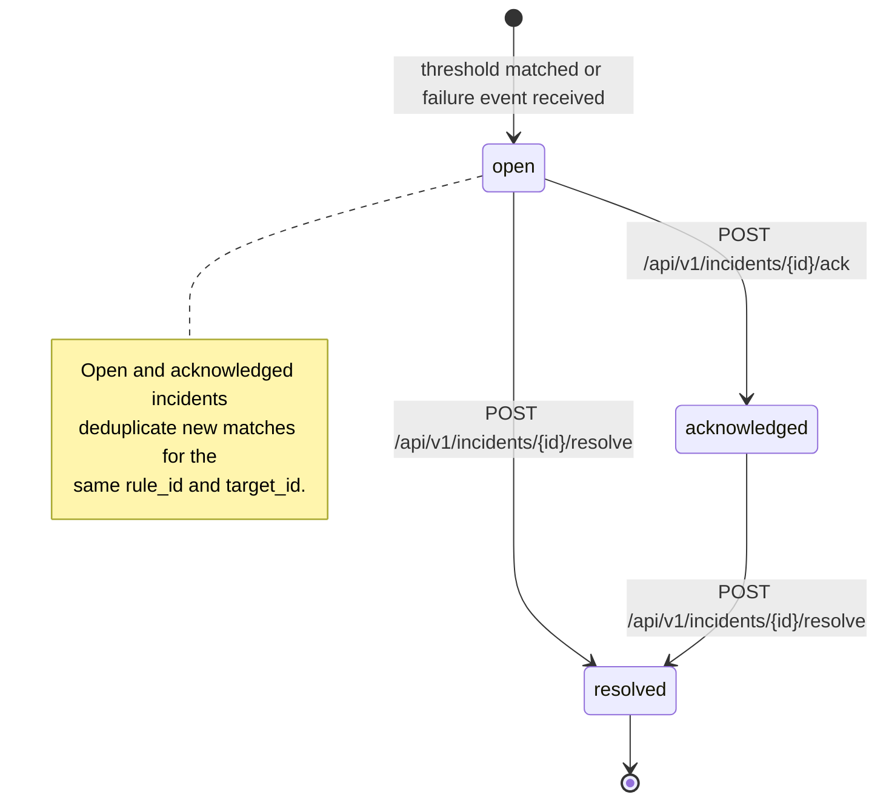

## 15. Recovery action lifecycle state diagram

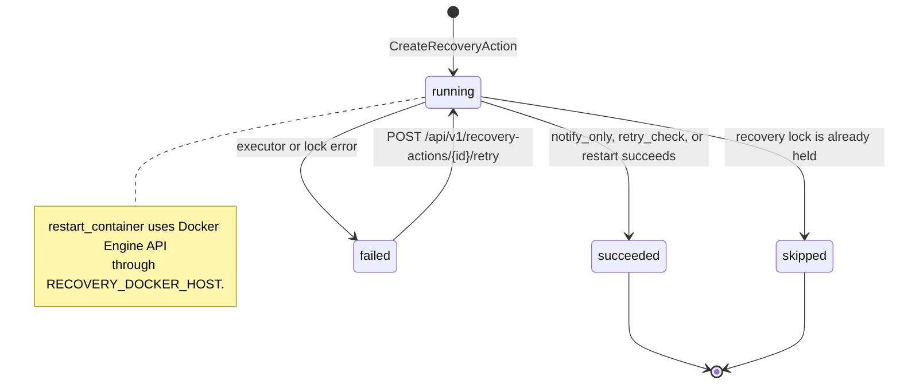
